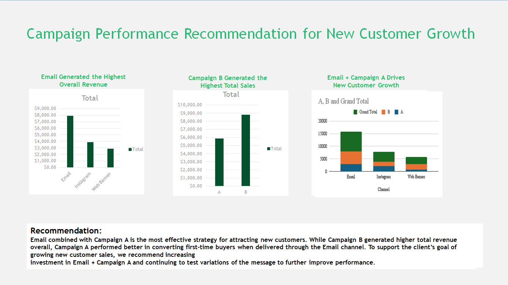

# BCG – Data for Decision Makers | Campaign Performance Analysis

## Project Overview

This project was completed as part of the **BCG Introduction to Data for Decision Makers Job Simulation on Forage**.

The objective of the project was to analyze marketing campaign performance across multiple channels and messaging strategies to identify the most effective combination for acquiring **new customers**.

The analysis focuses on understanding how different campaigns perform across **Email, Instagram, and Web Banner channels** and how messaging style influences customer conversions.

---

## Dashboard Preview

---

## Dataset

The dataset contains simulated marketing campaign data including:

- Campaign Type (A / B)
- Marketing Channel (Email, Instagram, Web Banner)
- Customer Type (New / Existing)
- Conversion status
- Time spent on site
- Sales revenue

File included:

Campaign_Data_Week1.xlsx

---

## Key Business Question

**Which campaign + marketing channel combination should the company prioritize to maximize new customer acquisition?**

---

## Key Insights

- **Email generated the highest total revenue** among all channels.
- **Campaign B produced the highest overall sales**.
- **Campaign A performed better at converting new customers.**
- The combination **Email + Campaign A delivered the strongest results for new customer growth.**

---

## Recommendation

To support the client’s goal of increasing new customer acquisition:

- Prioritize **Email campaigns using Campaign A messaging**
- Continue testing message variations to further improve performance
- Focus marketing budget on high-performing channels with strong conversion potential

---

## Files in This Repository

Campaign_Data_Week1.xlsx # Marketing campaign dataset
BCG_Campaign_Recommendation.pptx # Final consulting-style recommendation slide
dashboard-preview.png # Visualization preview
bcg-certificate.pdf # Completion certificate

---

## Certificate

This project was completed as part of the **BCG Introduction to Data for Decision Makers Simulation** on Forage.

---

## Author

**Amit Roy**

Data Analyst | Business Intelligence | Data Visualization  

Skills:

- SQL
- Power BI
- Tableau
- Excel
- Data Analysis
- Business Intelligence
- Dashboard Development

---

## Project Status

Completed – March 2026

